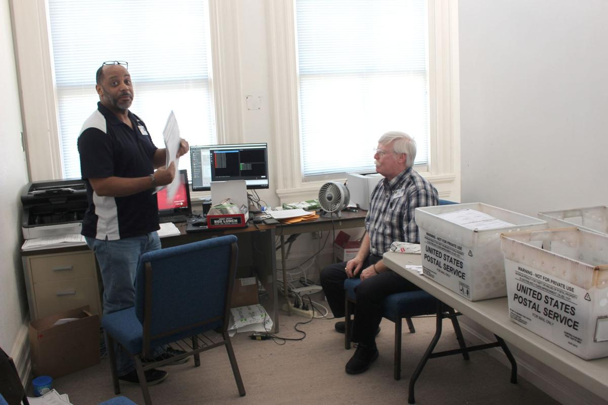
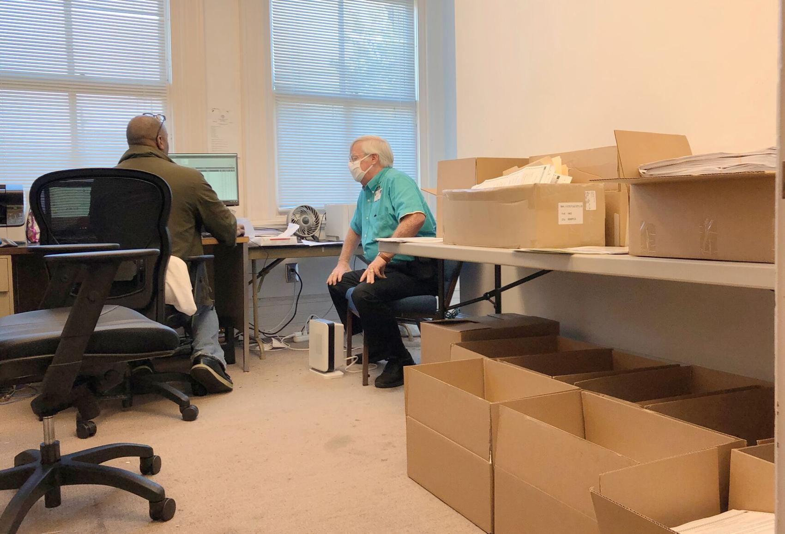

# Dominion Rep in Floyd Country
[Why Floyd County had to wait so long for Election Day results](https://archive.vn/qrlgJ)

[Atl Official photographer for Senator Kamala Harris as she runs for President in 2020!](https://archive.vn/zRRYN)

[Why Floyd County had to wait so long for Election Day results](https://www.northwestgeorgianews.com/rome/news/local/why-floyd-county-had-to-wait-so-long-for-election-day-results/article_2a977cf2-1eb4-11eb-bbd0-97326e236096.html)

[Why Floyd County had to wait so long for Election Day results - PDF](../images/AricFloydCounty.pdf)

[Runoff in sheriff's race, Penson and Richardson hold onto posts of clerk and chief magistrate](https://www.northwestgeorgianews.com/rome/news/local/elections-officials-still-counting-absentee-ballots/article_9f5cef2c-ab64-11ea-9e89-2bb34caefffc.html)

[Runoff in sheriff's race, Penson and Richardson hold onto posts of clerk and chief magistrate - PDF](../images/AricAbsenteeRunoff.pdf)

# Dominion's claims about the 2020 election

[Election 2020: Setting the Record Straight - Dominion Voting Systems](https://www.dominionvoting.com/)

[Voting machine CEO denies allegations / He says Venezuela is not an investor](https://www.sfgate.com/politics/article/Voting-machine-CEO-denies-allegations-He-says-2548220.php)

[Los Angeles County’s risky voting experiment - POLITICO](https://www.politico.com/news/2020/03/03/los-angeles-county-voting-experiment-119157)

[Cause of Election Day glitch in Georgia counties still unexplained - POLITICO](https://www.politico.com/news/2020/11/04/georgia-election-machine-glitch-434065)

[US election: Georgia ‘burst pipe’ story called into question](https://www.news.com.au/world/north-america/us-politics/slow-leak-text-messages-cast-doubt-on-georgia-officials-burst-pipe-excuse-for-pause-in-counting/news-story/19176f5113512210517c82debe684392)

[U.S. Investigates Voting Machines’ Venezuela Ties - The New York Times](https://www.nytimes.com/2006/10/29/washington/29ballot.html)